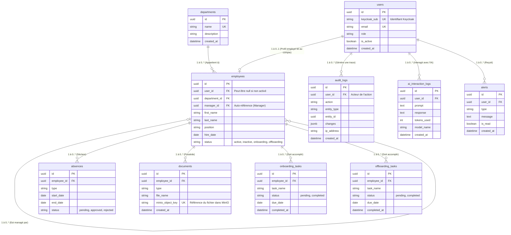

# Modèle Conceptuel de Données (MCD) / Modèle Logique de Données (MLD)

Ce document présente l'architecture de la base de données relationnelle interne du projet **YDAYS 2026 - Plateforme IA RH**. Le modèle est géré par **SQLAlchemy** et **Alembic**.

## Diagramme Entité-Association (ERD)

## Description des Domaines

### 1. Domaine Utilisateurs & Sécurité (Auth / RBAC)
- **`users`** : Table centrale de l'authentification. Elle ne stocke pas de mot de passe car l'authentification est déléguée à Keycloak. Le champ `keycloak_sub` fait le lien avec l'Identity Provider.
- **`audit_logs`** : Permet la traçabilité complète des actions sensibles (CRUD, modération) pour la conformité sécurité.
- **`alerts`** : Notifications poussées aux utilisateurs (sécurité, workflow RH).

### 2. Domaine Ressources Humaines (SIRH Core)
- **`employees`** : Table principale du métier RH contenant les informations personnelles et organisationnelles de l'employé.
- **`departments`** : Nomenclature des départements.
- **`absences`** : Gestion des congés et absences.
- **`documents`** : Pointeurs vers les documents réels stockés dans MinIO via le champ `minio_object_key`.
- **`onboarding_tasks` / `offboarding_tasks`** : Listes de contrôle (checklists) pour l'intégration et le départ des collaborateurs.

### 3. Domaine Intelligence Artificielle (RAG / LLM)
- **`ai_interaction_logs`** : Conserve l'historique des prompts et réponses générées par les modèles de LLM (Gemini/Mistral) pour un utilisateur, permettant l'analyse de l'usage, le calcul des coûts (tokens), et l'audit des "guardrails".
